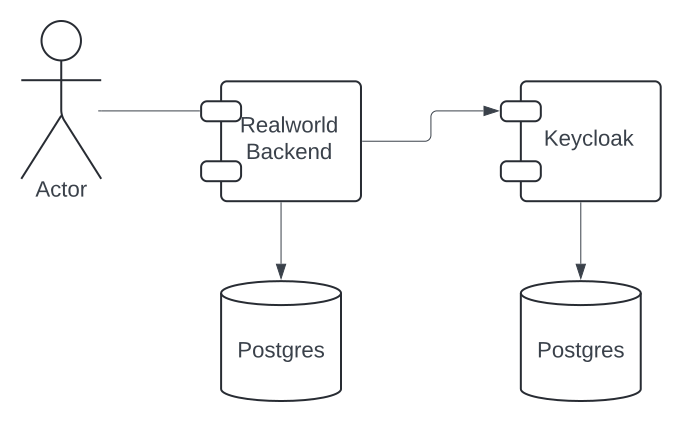
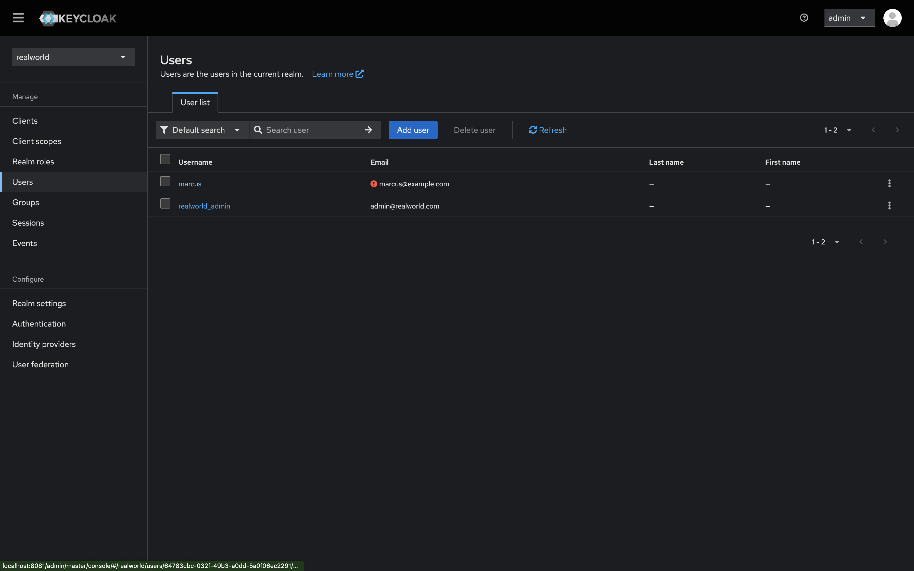
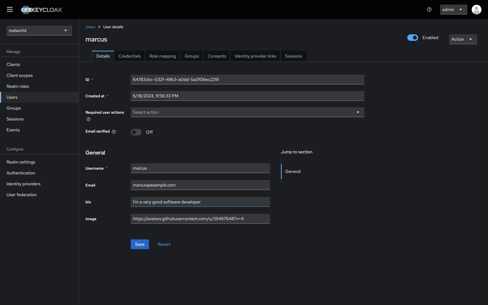

# 

> ### [Spring Boot](https://spring.io/projects/spring-boot) codebase containing real world examples (CRUD, auth, advanced patterns, etc) that adheres to the [RealWorld](https://github.com/gothinkster/realworld) spec and API.

### [Demo](https://demo.realworld.io/)&nbsp;&nbsp;&nbsp;&nbsp;[RealWorld](https://github.com/gothinkster/realworld)

This codebase was created to demonstrate a fully fledged backend application built with **[Spring Boot](https://spring.io/projects/spring-boot)** including CRUD operations, authentication, routing, pagination, and more.

We've gone to great lengths to adhere to the **[Spring Boot](https://spring.io/projects/spring-boot)** community styleguides & best practices.

For more information on how to this works with other frontends/backends, head over to the [RealWorld](https://github.com/gothinkster/realworld) repo.

# How it works

- It uses a [Modular Monolith architecture](https://www.milanjovanovic.tech/blog/what-is-a-modular-monolith) with clearly defined boundaries and independent modules ([users](src/main/java/com/marcusmonteirodesouza/realworld/api/users), [profiles](src/main/java/com/marcusmonteirodesouza/realworld/api/profiles), and [articles](src/main/java/com/marcusmonteirodesouza/realworld/api/articles)).
- It uses [Spring Security](https://spring.io/projects/spring-security) and [Keycloak](https://www.keycloak.org/) for user registration, authentication, and authorization. It provides good examples of usage of the [Keycloak Admin REST Client](https://mvnrepository.com/artifact/org.keycloak/keycloak-admin-client), including User creation and JWT generation ([See](src/main/java/com/marcusmonteirodesouza/realworld/api/users/services/users/UsersService.java)).
- Both Keycloak and the Realworld backend application use [PostgreSQL](https://www.postgresql.org/) as their database/datasource. The Realworld backend application uses [Jakarta Persistence](https://jakarta.ee/learn/docs/jakartaee-tutorial/current/persist/persistence-intro/persistence-intro.html) (JPA) as an object/relational mapping facility (ORM).
- It handles exceptions in a [centralized way](src/main/java/com/marcusmonteirodesouza/realworld/api/exceptionhandlers/RestResponseEntityExceptionHandler.java), extending the [ResponseEntityExceptionHandler](https://docs.spring.io/spring-framework/docs/current/javadoc-api/org/springframework/web/servlet/mvc/method/annotation/ResponseEntityExceptionHandler.html) class.

# Getting started

1. Run `cp .env.template .env`. The `.env` file contains the environment variables used by both Keycloak and the Realworld backend application, including secrets.

## Set up Keycloak

Follow the [documentation](docs/set-up-keycloak)

## Run the application

1. Run `docker compose up`.
1. When you register or update an user, you can see it listed and also it's details on the [Keycloak admin console](http://localhost:8081).
   
   
