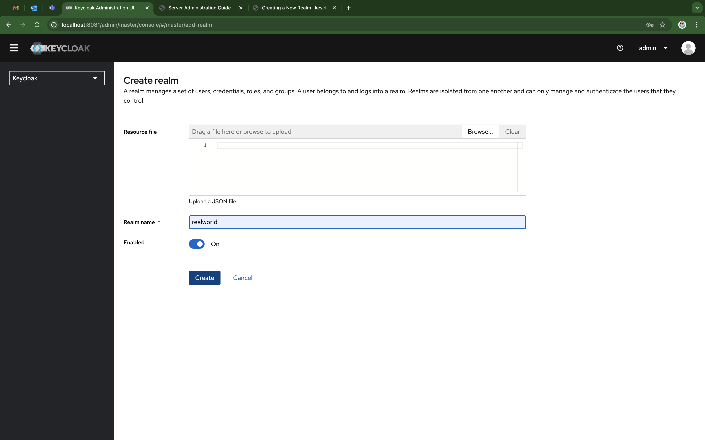
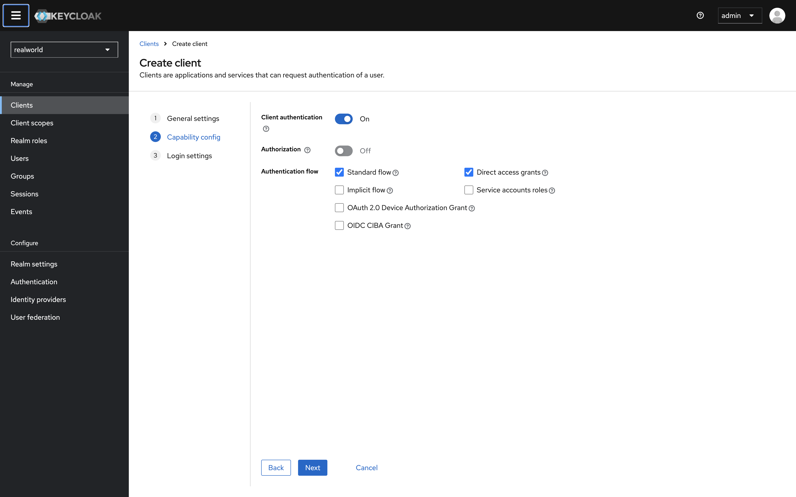
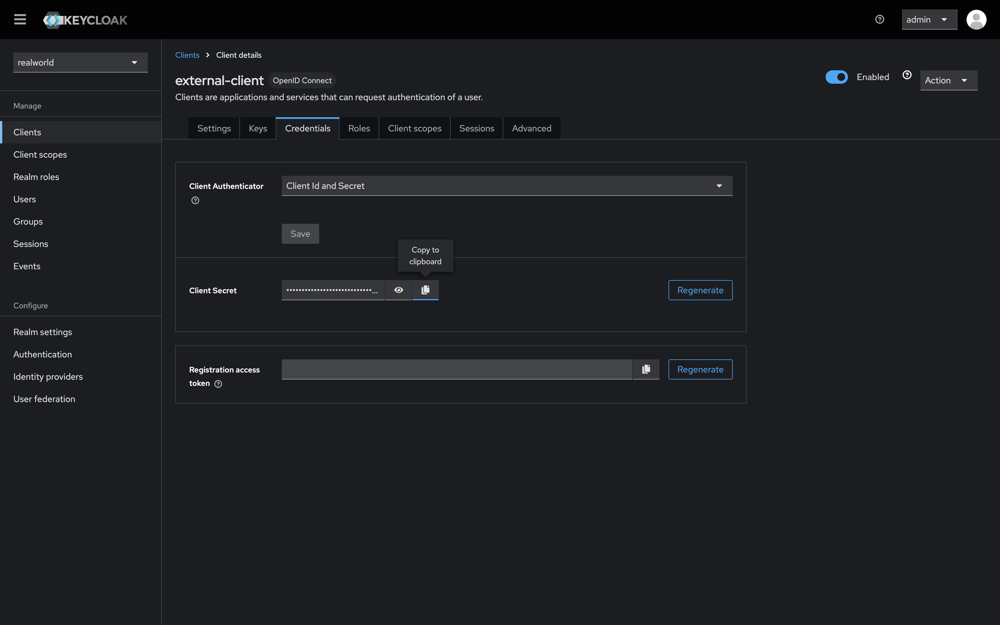
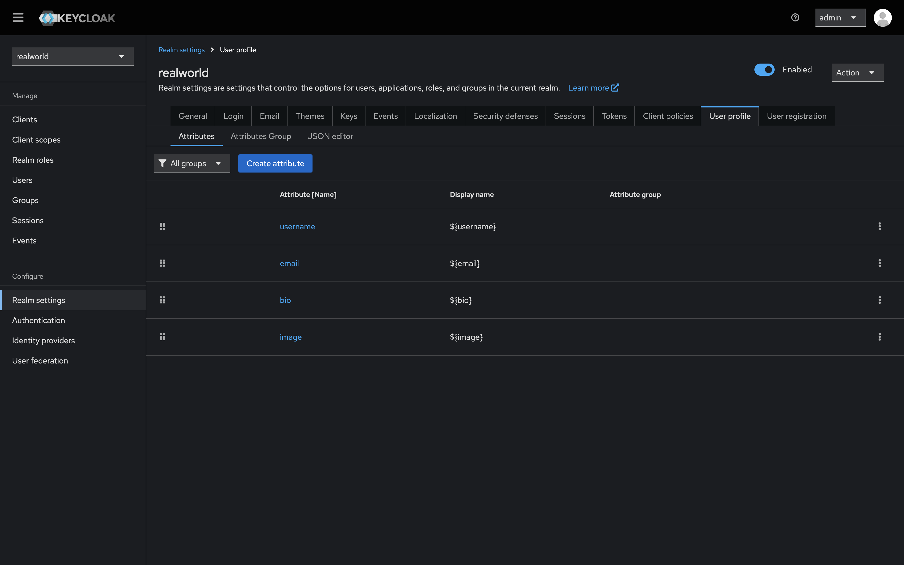
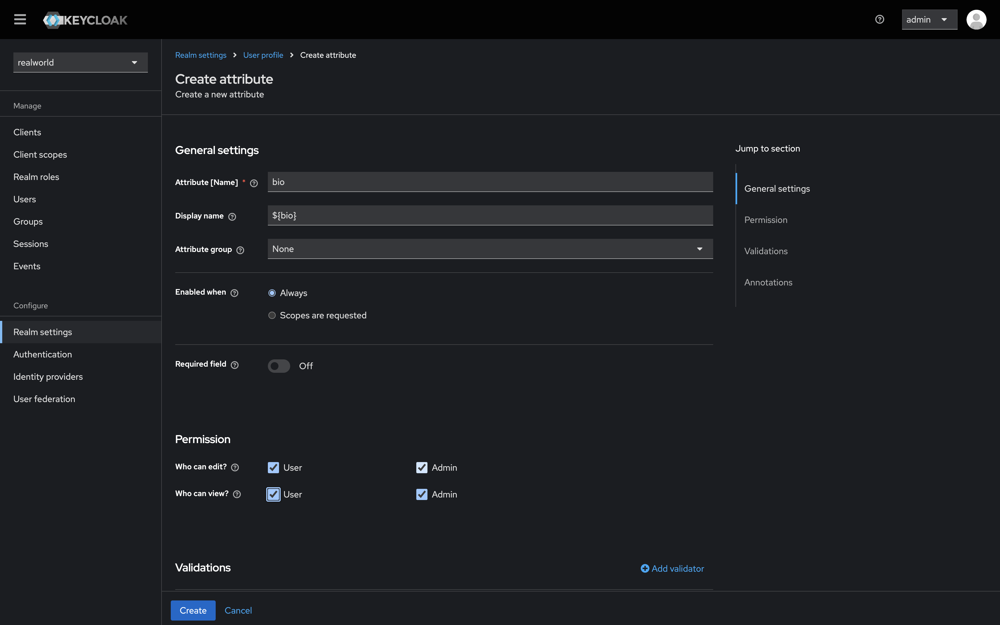
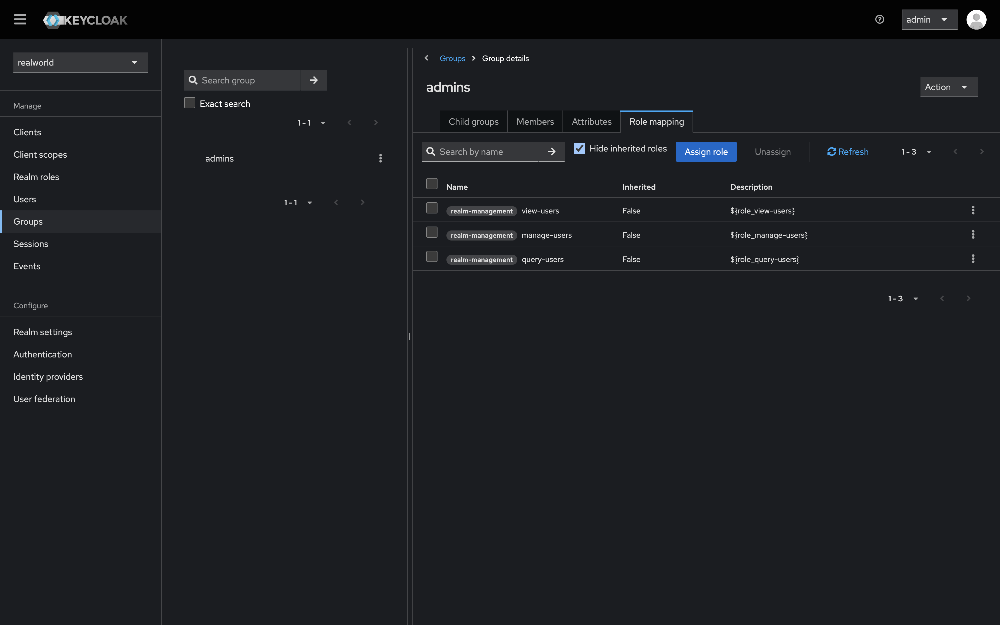
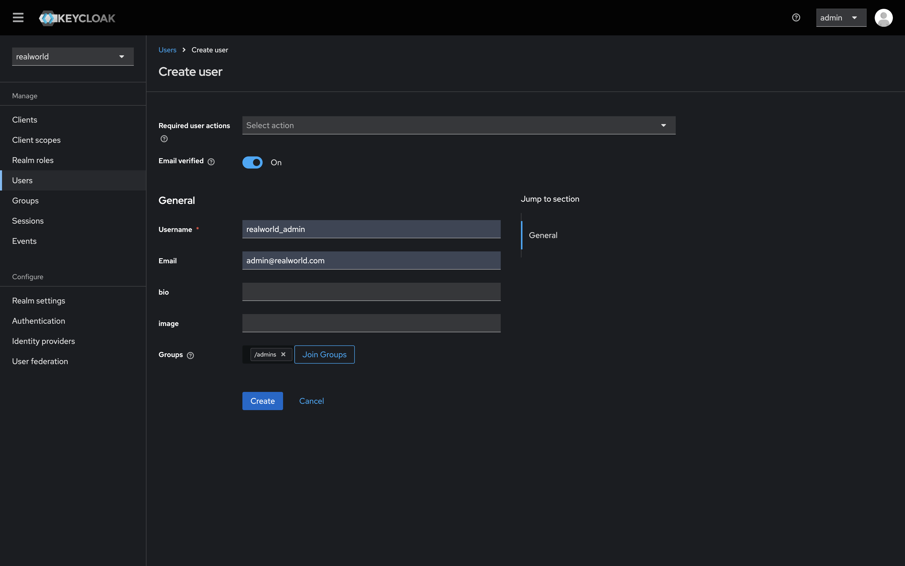
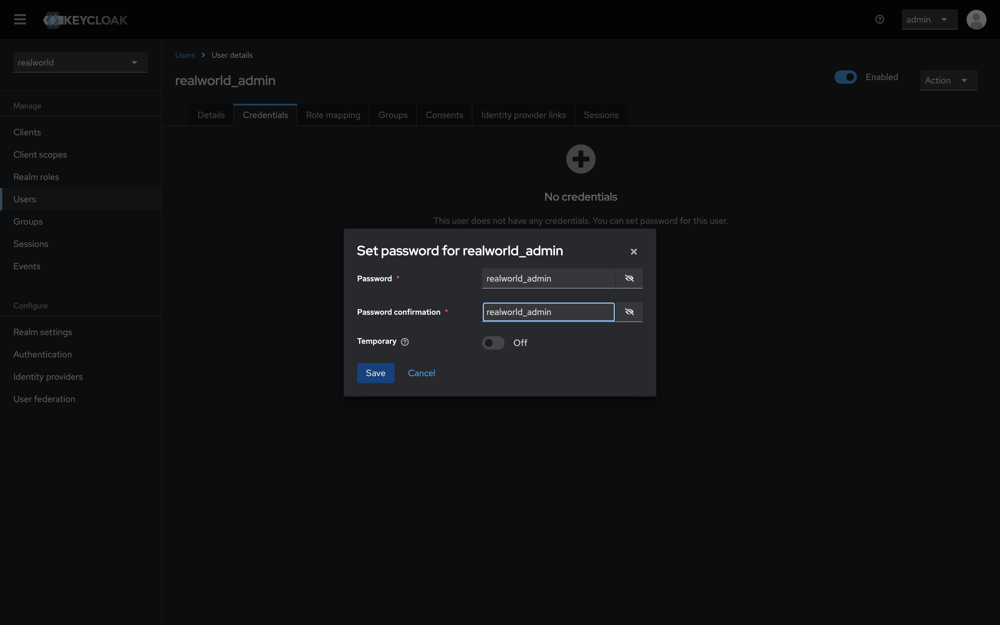

# Set up [Keycloak](https://www.keycloak.org/)

1. Run `docker compose up keycloak`.
1. Sign in into the [admin console](http://localhost:8081). Both username and password are `admin`, as set in the [`docker-compose.yaml`](../../docker-compose.yaml) using the [`KEYCLOAK_ADMIN` and `KEYCLOAK_ADMIN_PASSWORD` environment variables](https://www.keycloak.org/server/configuration#_creating_the_initial_admin_user).
1. [Create a new Realm](https://www.keycloak.org/docs/latest/server_admin/#proc-creating-a-realm_server_administration_guide). The realm should be named after the value of the `KEYCLOAK_REALM` environment variable (e.g. `realworld`).
   
1. [Create a new OIDC client](https://wjw465150.gitbooks.io/keycloak-documentation/content/server_admin/topics/clients/client-oidc.html). The client should be named after the value `KEYCLOAK_REALM_CLIENT_ID` environment variable (e.g. `external-client`). Enable `Client authentication`. After you save the client, go to the `Credentials` tab, copy the `Client Secret` and set the `KEYCLOAK_REALM_CLIENT_SECRET` environment variable to it's value.
   
   
1. Go to `Realm settings`, then go to the `User profile` tab. Delete the `firstName` and `lastName` attributes and add `bio` and `image` as attributes. When creating the new attributes, set `Required field` to `Off` and check all the `Permission` checkboxes.
   
   
1. [Create an admins group](https://www.keycloak.org/docs/latest/server_admin/#proc-managing-groups_server_administration_guide) and assign all `users` related roles to it.
   
1. [Create an user](https://www.keycloak.org/docs/latest/server_admin/#proc-creating-user_server_administration_guide) to serve as the `admin` user with which the `Realworld backend application` will use to connect to Keycloak. It's username should have the same value as the `KEYCLOAK_REALM_ADMIN` environment variable, and it's password should have the same value as the `KEYCLOAK_REALM_ADMIN_PASSWORD` environment variable. Remove any `Required user actions`. Set `Email verified` to `On`. Add the created user to the `admins` group. Go to the `Credentials` tab to set up the password, and set `Temporary` to `Off`.
   
   
1. Sign out of the admin console.
1. Stop the containers by running `CTRL + C` or `docker compose down`.
